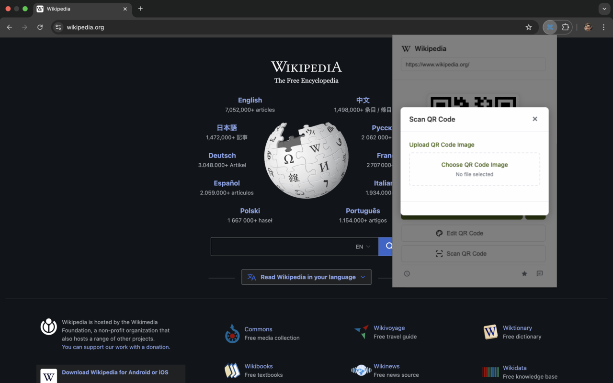

# QR Code Generator & Scanner - 免费离线二维码生成器

<div align="center">

[](https://chrome.google.com/webstore/detail/qr-code-generator-scanner/fjhdmehmeknophjlcfanlfmajjaeekol) [](https://addons.mozilla.org/zh-CN/firefox/addon/best-qr-code/)
[](https://chrome.google.com/webstore/detail/qr-code-generator-scanner/fjhdmehmeknophjlcfanlfmajjaeekol)
[](LICENSE)


**一个功能强大的浏览器扩展，支持生成和扫描二维码，完全离线工作，支持多种浏览器。**

</div>


## 📸 功能截图

<div align="center">

### 主页面 - 一键生成当前页面二维码


### 自定义页面 - 支持Logo和颜色自定义


### 扫描页面 - 上传图片识别二维码


### 历史记录 - 查看生成和扫描历史


</div>

## 🌟 功能特性

### 二维码生成
- **当前页面二维码**：一键为当前浏览的网页生成二维码
- **自定义文本二维码**：支持为任意文本内容生成二维码
- **右键菜单集成**：在网页上右键选择文本即可生成二维码
- **快捷键支持**：
  - `Ctrl+Shift+Q` (Windows/Linux) / `Cmd+Shift+Q` (Mac)：为当前页面生成二维码
  - `Ctrl+Shift+T` (Windows/Linux) / `Cmd+Shift+T` (Mac)：为选中文本生成二维码

### 二维码自定义
- **颜色自定义**：支持自定义前景色和背景色
- **尺寸调整**：可调整二维码的宽度和高度（120px-1024px）
- **Logo支持**：支持在二维码中心添加自定义Logo
- **Logo透明度**：可调整Logo的透明度

### 二维码扫描
- **图片上传扫描**：支持上传二维码图片进行扫描
- **智能识别**：自动识别二维码内容类型（URL、文本等）
- **结果操作**：支持复制扫描结果或直接打开链接

### 历史记录
- **生成历史**：记录所有生成的二维码
- **扫描历史**：记录所有扫描的二维码
- **快速访问**：从历史记录中快速重新生成或访问

### 其他功能
- **离线工作**：所有功能完全离线，无需网络连接
- **多浏览器支持**：支持Chrome、Firefox、Edge浏览器
- **一键下载**：支持将二维码保存为PNG图片
- **一键复制**：支持复制二维码图片到剪贴板


### 🎯 快速安装

**推荐方式**：直接点击上方按钮从官方商店安装
- [Chrome Web Store](https://chrome.google.com/webstore/detail/qr-code-generator-scanner/fjhdmehmeknophjlcfanlfmajjaeekol) - 一键安装
- [Firefox Add-ons](https://addons.mozilla.org/zh-CN/firefox/addon/best-qr-code/) - 一键安装

**开发者模式**：如需从源码安装，请参考下方详细步骤

## 🚀 安装方法

### Chrome浏览器
1. 下载或克隆此项目
2. 运行构建命令：`npm run build:chrome`
3. 打开Chrome浏览器，进入 `chrome://extensions/`
4. 开启"开发者模式"
5. 点击"加载已解压的扩展程序"
6. 选择 `dist/chrome` 文件夹

### Firefox浏览器
1. 下载或克隆此项目
2. 运行构建命令：`npm run build:firefox`
3. 打开Firefox浏览器，进入 `about:debugging`
4. 点击"此Firefox"
5. 点击"临时载入附加组件"
6. 选择 `dist/firefox/manifest.json` 文件

### Edge浏览器
1. 下载或克隆此项目
2. 运行构建命令：`npm run build:edge`
3. 打开Edge浏览器，进入 `edge://extensions/`
4. 开启"开发人员模式"
5. 点击"加载解压缩的扩展"
6. 选择 `dist/edge` 文件夹

## 📦 打包发布

### 构建所有浏览器版本
```bash
npm run build:all
```

### 打包为发布文件
```bash
# 打包Chrome版本
npm run pack:chrome

# 打包Firefox版本
npm run pack:firefox

# 打包Edge版本
npm run pack:edge

# 打包所有版本
npm run pack:all
```

打包后的文件将保存在 `build/` 目录中：
- `chrome.zip` - Chrome扩展包
- `firefox.xpi` - Firefox扩展包
- `edge.zip` - Edge扩展包

## 🛠️ 开发指南

### 环境要求
- Node.js 14.0+
- npm 6.0+

### 安装依赖
```bash
npm install
```

### 开发模式
```bash
npm run dev
```

### 项目结构
```
chrome-extension-qrcode/
├── src/                    # 源代码目录
│   ├── popup.html         # 弹窗页面
│   ├── popup.css          # 弹窗样式
│   ├── popup.js           # 弹窗逻辑
│   ├── background.js      # 后台脚本
│   └── content.js         # 内容脚本
├── manifest/              # 浏览器配置文件
│   ├── chrome.json        # Chrome配置
│   ├── firefox.json       # Firefox配置
│   └── edge.json          # Edge配置
├── libs/                  # 第三方库
│   ├── qrcode.js          # 二维码生成库
│   ├── qrcode-with-logo.js # 带Logo的二维码生成
│   ├── jsqr.js            # 二维码扫描库
│   └── jsqr-improve.js    # 改进的扫描库
├── icons/                 # 扩展图标
├── asserts/               # 资源文件
├── images/                # 图片资源
├── webpack.config.js      # Webpack配置
└── package.json           # 项目配置
```

### 技术栈
- **前端**：HTML5, CSS3, JavaScript (ES6+)
- **构建工具**：Webpack 5
- **二维码生成**：qrcode.js
- **二维码扫描**：jsQR
- **浏览器API**：Chrome Extensions API, Web Extensions API

### 浏览器兼容性
- **Chrome**：Manifest V3
- **Firefox**：Manifest V2
- **Edge**：Manifest V3

## 📝 使用说明

### 基本使用
1. 点击浏览器工具栏中的扩展图标
2. 扩展会自动为当前页面生成二维码
3. 使用各种按钮进行下载、复制、编辑等操作

### 自定义二维码
1. 点击"Edit QR Code"按钮
2. 在弹出窗口中调整颜色、尺寸、Logo等设置
3. 点击"Apply"应用更改

### 扫描二维码
1. 点击"Scan QR Code"按钮
2. 上传包含二维码的图片文件
3. 查看扫描结果并选择复制或打开

### 查看历史
1. 点击历史记录图标
2. 在"Generated"标签中查看生成历史
3. 在"Scanned"标签中查看扫描历史

## 🔧 配置说明

### 权限说明
- `activeTab`：访问当前活动标签页
- `contextMenus`：创建右键菜单
- `storage`：存储用户数据
- `downloads`：下载文件
- `tabs`：访问标签页信息
- `http://*/*`, `https://*/*`：访问网页内容

### 快捷键配置
可在 `manifest/*.json` 文件中的 `commands` 部分修改快捷键设置。

## 🤝 贡献指南

1. Fork 此项目
2. 创建功能分支：`git checkout -b feature/AmazingFeature`
3. 提交更改：`git commit -m 'Add some AmazingFeature'`
4. 推送到分支：`git push origin feature/AmazingFeature`
5. 提交Pull Request

## 📄 许可证

本项目采用 MIT 许可证 - 查看 [LICENSE](LICENSE) 文件了解详情。

## 🙏 致谢

- [qrcode.js](https://github.com/davidshimjs/qrcodejs) - 二维码生成库
- [jsQR](https://github.com/cozmo/jsQR) - 二维码扫描库
- 所有贡献者和用户的支持

---

**注意**：此扩展完全离线工作，不会收集或上传任何用户数据，保护您的隐私安全。
